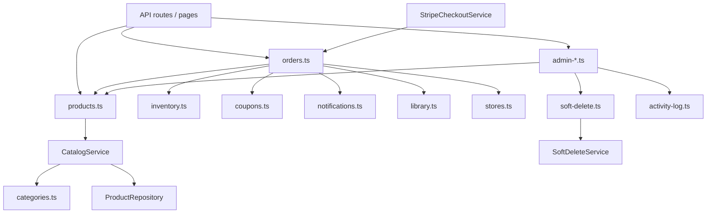

# Service Layer Overview

All business logic lives in `lib/services/`. API routes and server pages should call services — not Prisma directly.

**Pagination helpers** (not a service): `lib/api/pagination.ts` — when to use **cursor** (storefront Load more) vs **offset** (admin / account tables). Debounce: `hooks/use-debounced-value.ts`.

---

## Architecture

```
API route / Server page
        │
        ▼
  lib/services/*.ts     ← you import from here
        │
        ├── Repository (lib/repositories/)  — Prisma queries + DTO mapping
        ├── Other services                — orchestration
        └── Prisma                        — transactions
```

| Pattern               | Files                                                          | When to use                                       |
| --------------------- | -------------------------------------------------------------- | ------------------------------------------------- |
| **Thin facade**       | `products.ts`, `soft-delete.ts`                                | Stable import paths; delegates to class singleton |
| **Class + singleton** | `CatalogService`, `SoftDeleteService`, `StripeCheckoutService` | Complex domain with multiple methods              |
| **Functional module** | `orders.ts`, `inventory.ts`, `admin-*.ts`                      | Straightforward CRUD / workflows                  |

---

## Service index

| Module                     | Exports (main)                                                      | Doc                                      |
| -------------------------- | ------------------------------------------------------------------- | ---------------------------------------- |
| `products.ts`              | `getProducts`, `getProductBySlug`, `getProductsByIds`               | [catalog.md](./catalog.md)               |
| `CatalogService.ts`        | Class behind `products.ts` facade                                   | [catalog.md](./catalog.md)               |
| `categories.ts`            | `listCategoryTree`, `getCategorySlugsIncludingDescendants`          | [catalog.md](./catalog.md)               |
| `stores.ts`                | `listStores`, `listAdminStoresPage`, `getStoreProfile`              | [catalog.md](./catalog.md)               |
| `products-client.ts`       | `fetchProducts` (browser; passes `cursor` / `pageSize`)             | [catalog.md](./catalog.md)               |
| `orders.ts`                | `createOrderFromCart`, `listAllOrdersPage`, `listUserOrdersPage`    | [commerce.md](./commerce.md)             |
| `inventory.ts`             | `assertSufficientStockForOrderLines`, `decrementStockForOrderLines` | [commerce.md](./commerce.md)             |
| `coupons.ts`               | `getActiveCouponByCode`, `recordCouponUsage`                        | [commerce.md](./commerce.md)             |
| `StripeCheckoutService.ts` | `createCheckoutSession`, `verifySessionAndFulfill`                  | [commerce.md](./commerce.md)             |
| `wishlist.ts`              | `listWishlist`, `toggleWishlistItem`                                | [user-services.md](./user-services.md)   |
| `reviews.ts`               | `listProductReviews`, `createProductReview`                         | [user-services.md](./user-services.md)   |
| `notifications.ts`         | `notifyOrderStatusChange`, `listUserNotifications`                  | [user-services.md](./user-services.md)   |
| `library.ts`               | `listUserLibrary`, `grantLibraryAccessForOrder`                     | [user-services.md](./user-services.md)   |
| `verification-tokens.ts`   | `createEmailVerificationToken`                                      | [auth-services.md](./auth-services.md)   |
| `email-verification.ts`    | `verifyEmailAndIssueLoginToken`                                     | [auth-services.md](./auth-services.md)   |
| `admin-products.ts`        | `createProduct`, `updateProduct`, `deleteProduct`                   | [admin-services.md](./admin-services.md) |
| `admin-stores.ts`          | `createStore`, `updateStore`, `deleteStore`                         | [admin-services.md](./admin-services.md) |
| `admin-categories.ts`      | `createAdminCategory`, `deleteAdminCategory`                        | [admin-services.md](./admin-services.md) |
| `admin-coupons.ts`         | `createAdminCoupon`, `deleteAdminCoupon`                            | [admin-services.md](./admin-services.md) |
| `admin-users.ts`           | `updateUserRole`                                                    | [admin-services.md](./admin-services.md) |
| `activity-log.ts`          | `recordActivity`, `listActivityLogs`                                | [admin-services.md](./admin-services.md) |
| `soft-delete.ts`           | `NOT_DELETED`, `softDeleteProductById`, …                           | [core-services.md](./core-services.md)   |
| `SoftDeleteService.ts`     | Class behind `soft-delete.ts`                                       | [core-services.md](./core-services.md)   |

---

## Dependency graph



---

## Conventions

1. **Import facades** — use `@/lib/services/products` not `CatalogService` directly in routes.
2. **Transactions** — `orders.ts` and `inventory.ts` accept `Prisma.TransactionClient` for atomic stock + order writes.
3. **Soft deletes** — spread `NOT_DELETED` in every read query; use `softDelete*` helpers for deletes.
4. **Activity logging** — admin mutation routes call `logAdminActivity()` from `lib/admin-activity.ts`, which wraps `recordActivity()`.
