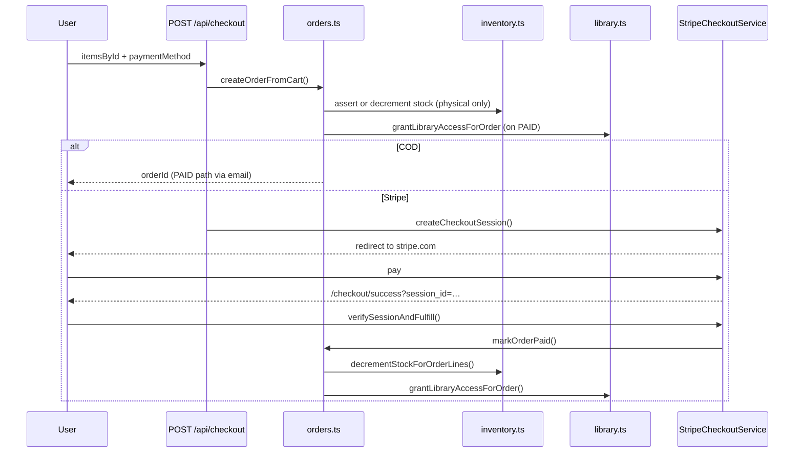

# Commerce Services

Modules: `orders.ts`, `inventory.ts`, `coupons.ts`, `StripeCheckoutService.ts`

---

## `orders.ts` — order lifecycle

**Purpose:** Cart → order creation, payment fulfillment, status updates, analytics. Digital library grants are delegated to `library.ts`.

### Key exports

| Function              | Description                                                 |
| --------------------- | ----------------------------------------------------------- |
| `createOrderFromCart` | Validate cart, price, stock; create `PENDING` order         |
| `markOrderPaid`       | Stripe success — decrement stock, set `PAID`, grant library |
| `listUserOrders`      | Full customer history (legacy / SSR helpers)                |
| `listUserOrdersPage`  | **Offset**-paginated My Orders (`page`, `pageSize`, search) |
| `listAllOrders`       | Unpaged admin list (KPIs / dashboard)                       |
| `listAllOrdersPage`   | **Offset**-paginated admin orders table                     |
| `getOrderById`        | Detail view (owner or admin)                                |
| `updateOrderStatus`   | Admin: status change + notification + library on `PAID`     |
| `getAdminKpis`        | Dashboard KPI cards                                         |
| `getAnalytics`        | Revenue / orders charts (super admin)                       |
| `listUsers`           | **Offset**-paginated user table (super admin)               |

Library listing/download: `lib/services/library.ts` — see [user-services.md](./user-services.md).

### Code demo — checkout API (validated body)

```typescript
// app/api/checkout/route.ts
import { checkoutBodySchema } from '@/lib/validations/cart'
import { createOrderFromCart } from '@/lib/services/orders'

const validated = checkoutBodySchema.safeParse(body)
// itemsById: productId, variantId, quantity only — no client prices

const order = await createOrderFromCart(user.id, body.itemsById, body.promoCode, {
  paymentMethod: body.paymentMethod ?? 'STRIPE',
  shippingAddress: body.shippingAddress,
})
```

### Code demo — server-side pricing (never trust client)

```typescript
// lib/services/orders.ts — createOrderFromCart
const sanitizedItems = sanitizeCartItemsById(itemsById)
const products = await getProductsByIds(productIds)
const pricing = calculateCartPricing({
  itemsById: sanitizedItems,
  productsById,
  promoCode,
  coupon,
  taxRate: defaults.taxRate,
  shippingFlat: defaults.shippingFlat,
  freeShippingThreshold: defaults.freeShippingThreshold,
})
// resolveLineUnitPrice(product, variantId) for each line

// Digital cart rules
if (paymentMethod === 'COD' && cartHasDigitalProduct(cartLines, productsById)) {
  throw new Error('Digital products must be paid online.')
}
const allDigital = cartIsAllDigital(cartLines, productsById)
// shippingFlat / freeShippingThreshold → 0 when allDigital
```

### Code demo — library grant on payment

```typescript
// lib/services/orders.ts — markOrderPaid / updateOrderStatus
await grantLibraryAccessForOrder(orderId)
// Upserts LibraryItem for each digital line in the order
```

### Code demo — checkout API (COD + Stripe)

```typescript
// app/api/checkout/route.ts
import { createOrderFromCart } from '@/lib/services/orders'
import { stripeCheckoutService } from '@/lib/services/StripeCheckoutService'

const order = await createOrderFromCart(user.id, itemsById, promoCode, {
  paymentMethod: body.paymentMethod ?? 'STRIPE',
  shippingAddress: body.shippingAddress,
})

if (paymentMethod === 'COD') {
  await sendOrderConfirmationEmail(order)
  return NextResponse.json({ orderId: order.id, paymentMethod: 'COD' })
}

const session = await stripeCheckoutService.createCheckoutSession(order, origin)
return NextResponse.json({ url: session.url, orderId: order.id })
```

### Code demo — order creation with stock rules

```typescript
// lib/services/orders.ts — inside prisma.$transaction
const fulfillmentLines = lines.map((line) => ({
  productId: line.productId,
  variantId: line.variantId,
  quantity: line.quantity,
  productName: productsById[line.productId]!.name,
}))

if (paymentMethod === 'COD') {
  await decrementStockForOrderLines(tx, fulfillmentLines) // immediate
} else {
  await assertSufficientStockForOrderLines(tx, fulfillmentLines) // reserve check
}
```

### Code demo — status change notifies customer

```typescript
// lib/services/orders.ts — updateOrderStatus
const existing = await prisma.order.findUnique({ where: { id }, select: { status: true, userId: true } })
const order = await prisma.order.update({ where: { id }, data: { status }, include: { ... } })
await notifyOrderStatusChange(existing.userId, id, existing.status, status)
// → PAID | SHIPPED | DELIVERED | CANCELLED create Notification rows
```

Also called from `markOrderPaid()` after Stripe/COD payment confirmation.

---

## `inventory.ts` — stock validation & decrement

**Purpose:** Internal service consumed by `orders.ts`. Handles variant-level and product-level stock. **Digital products are skipped** — no stock check or decrement.

### Key exports

| Function                             | Description                                               |
| ------------------------------------ | --------------------------------------------------------- |
| `assertSufficientStockForOrderLines` | Throws if any physical line exceeds available stock       |
| `decrementStockForOrderLines`        | Atomic decrement for physical lines; syncs variant totals |

### Code demo — variant decrement

```typescript
// lib/services/inventory.ts
import { isDigitalProduct } from '@/lib/utils/digital-products'

for (const line of lines) {
  const productMeta = await tx.product.findFirst({ where: { id: line.productId }, select: { isDigital: true } })
  if (productMeta && isDigitalProduct(productMeta)) continue
  // ... decrement variant or product stock
}
```

### When stock decrements

| Payment    | When                                         |
| ---------- | -------------------------------------------- |
| **COD**    | At `createOrderFromCart` (order creation)    |
| **Stripe** | At `markOrderPaid` (success page or webhook) |

---

## `coupons.ts` — promo codes

**Purpose:** Validate active coupons and track usage counts.

### Key exports

| Function                | Description                            |
| ----------------------- | -------------------------------------- |
| `getActiveCouponByCode` | Lookup + date/max-uses validation      |
| `recordCouponUsage`     | Increment `usedCount` after paid order |
| `listActiveCoupons`     | All valid coupons                      |

### Code demo — validate at checkout

```typescript
// lib/services/orders.ts
const coupon = normalizedPromo ? await getActiveCouponByCode(normalizedPromo) : null
if (normalizedPromo && !coupon) {
  throw new Error('Invalid or expired promo code')
}
```

### Code demo — API validate

```typescript
// app/api/coupons/route.ts
import { getActiveCouponByCode } from '@/lib/services/coupons'

const coupon = await getActiveCouponByCode(code)
if (!coupon) return NextResponse.json({ error: 'Invalid coupon' }, { status: 404 })
return NextResponse.json({ coupon })
```

---

## `StripeCheckoutService.ts` — hosted checkout

**Purpose:** Create Stripe Checkout sessions and verify payment on redirect.

### Key exports

| Method                                 | Description                          |
| -------------------------------------- | ------------------------------------ |
| `isConfigured()`                       | True when `STRIPE_SECRET_KEY` is set |
| `createCheckoutSession(order, origin)` | Build line items + redirect URL      |
| `verifySessionAndFulfill(sessionId)`   | Confirm payment → `markOrderPaid`    |

### Code demo — create session

```typescript
// lib/services/StripeCheckoutService.ts (simplified)
async createCheckoutSession(order, origin) {
  const session = await getStripeServer().checkout.sessions.create({
    mode: 'payment',
    line_items: this.buildLineItems(order, origin),
    success_url: `${origin}/checkout/success?orderId=${order.id}&session_id={CHECKOUT_SESSION_ID}`,
    cancel_url: `${origin}/checkout/cancel?orderId=${order.id}`,
    metadata: { orderId: order.id },
  })
  return { url: session.url!, sessionId: session.id, orderId: order.id }
}
```

### Code demo — success page fulfillment

```typescript
// app/[locale]/(storefront)/checkout/success/page.tsx
import { stripeCheckoutService } from '@/lib/services/StripeCheckoutService'

const sessionId = searchParams.session_id
if (sessionId) {
  await stripeCheckoutService.verifySessionAndFulfill(sessionId)
  // → calls markOrderPaid → decrementStockForOrderLines
}
```

---

## End-to-end checkout flow


